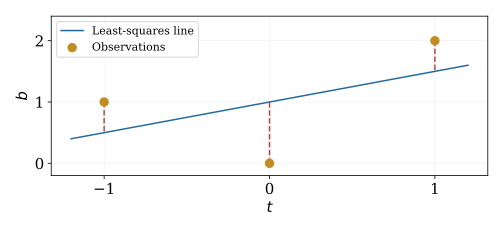

# Course Map {.deck-course-map}

::: {.columns}
::: {.column width="38%"}
<h3>Course decks</h3>

::: {style="font-size: 0.86em;"}
- [Why Linear Algebra?]()
- [Systems and Matrices]()
- [Inverses]()
- [Matrix Transformations]()
- [Determinants]()
- [Euclidean Spaces]()
- [Vector Spaces and Span]()
- [Bases and Coordinates]()
- [Matrix Spaces and Rank]()
- [Eigenvalues]()
- [Inner Products](){.current-deck aria-current="page"}
- [Special Topics]()
:::
:::

::: {.column width="4%"}
:::

::: {.column width="58%"}
<h3>In this deck</h3>

::: {.key-point}
Orthogonal directions separate what we can fit from what remains

$\vct{b}=\widehat{\vct{b}}+\vct{r},\qquad\widehat{\vct{b}}\perp\vct{r}$
:::

- [Inner Products and Geometry](#inner-products-and-geometry)
- [Orthogonality and Projection](#orthogonality-and-projection)
- [Gram–Schmidt and QR](#gram-schmidt-and-qr)
- [Least Squares and Regression](#least-squares-and-regression)
- [Function Approximation and Fourier Coordinates](#function-approximation-and-fourier-coordinates)
- [Big Ideas](#big-ideas)

:::
:::

# Inner Products and Geometry {#inner-products-and-geometry}

- [What measures the size of a vector?](#what-measures-the-size-of-a-vector)
- [The real inner-product axioms](#the-real-inner-product-axioms)
- [Weights change the geometry](#weights-change-the-geometry)
- [Continuous functions also have geometry](#continuous-functions-also-have-geometry)
- [Norms, distances, and angles follow](#norms-distances-and-angles-follow)
- [Practice testing an inner product](#practice-testing-an-inner-product)

## What measures the size of a vector? {#what-measures-the-size-of-a-vector}

Coordinates describe a vector; an inner product adds geometry

- Dot products in $\reals^n$
- Weighted measurements when coordinates have different scales
- Integrals comparing functions

::: {.key-point}
Choose the inner product to match what size and similarity mean in the problem
:::

## The real inner-product axioms {#the-real-inner-product-axioms}

An inner product on a real vector space $V$ assigns $\langle\vct{u},\vct{v}\rangle\in\reals$

For all vectors and real scalars:
\begin{align*}
\langle\vct{u},\vct{v}\rangle&=\langle\vct{v},\vct{u}\rangle\\
\langle a\vct{u}+b\vct{v},\vct{w}\rangle
&=a\langle\vct{u},\vct{w}\rangle+b\langle\vct{v},\vct{w}\rangle\\
\langle\vct{v},\vct{v}\rangle&\ge0,\qquad
\langle\vct{v},\vct{v}\rangle=0\iff\vct{v}=\vct{0}
\end{align*}

Symmetry makes linearity hold in both arguments

## Weights change the geometry {#weights-change-the-geometry}

\begin{gather*}
\langle\vct{u},\vct{v}\rangle_{\mat{W}}=\vct{u}^{\mathsf T}\mat{W}\vct{v},\qquad
\mat{W}=\mat{W}^{\mathsf T}\text{ positive definite}\\
\mat{W}=\begin{pmatrix}1&0\\0&4\end{pmatrix},\qquad
\left\|\begin{pmatrix}x_1\\x_2\end{pmatrix}\right\|_{\mat{W}}^2=x_1^2+4x_2^2
\end{gather*}

The weighted unit circle is an ellipse in standard coordinates

For $\vct{u}=(1,1)^{\mathsf T}$ and $\vct{v}=(4,-1)^{\mathsf T}$:
$\langle\vct{u},\vct{v}\rangle_{\mat{W}}=0$ but $\vct{u}^{\mathsf T}\vct{v}=3$

## Continuous functions also have geometry {#continuous-functions-also-have-geometry}

On $C([0,1])$, define
\begin{equation*}
\langle f,g\rangle=\int_0^1 f(t)g(t)\,\dif t
\end{equation*}

- Symmetry and linearity come from the integral
- A nonzero continuous function has positive squared integral
- Similarity compares entire functions, not only their sampled values

For $f(t)=1$, $g(t)=t$: $\langle f,g\rangle=1/2$

::: {.notes}
Continuity guarantees positive definiteness for actual functions. For general square-integrable functions, use equivalence classes modulo equality almost everywhere to obtain an inner-product space. Completeness and Hilbert spaces are later-course context.
:::

## Norms, distances, and angles follow {#norms-distances-and-angles-follow}

\begin{gather*}
\|\vct{v}\|=\sqrt{\langle\vct{v},\vct{v}\rangle},\qquad
d(\vct{u},\vct{v})=\|\vct{u}-\vct{v}\|\\
\cos\theta=\frac{\langle\vct{u},\vct{v}\rangle}{\|\vct{u}\|\|\vct{v}\|},
\quad\vct{u},\vct{v}\ne\vct{0}
\end{gather*}

Cauchy–Schwarz: $|\langle\vct{u},\vct{v}\rangle|\le\|\vct{u}\|\|\vct{v}\|$

Triangle inequality: $\|\vct{u}+\vct{v}\|\le\|\vct{u}\|+\|\vct{v}\|$

::: {.notes}
Cauchy–Schwarz follows by minimizing ||u-tv||^2 over real t when v is nonzero. Equality occurs exactly for linearly dependent vectors. Expand the squared norm and apply the inequality to obtain the triangle inequality.
:::

## Practice testing an inner product {#practice-testing-an-inner-product}

::: {.exitem}
$\exstar$
On $\reals^2$, which formulas are inner products? $u_1v_1+2u_2v_2$, $\quad u_1v_1-u_2v_2$, $\quad u_1v_1$ Name the failed axiom for each rejected formula
:::

::: {.notes}
The first is an inner product. The second is negative on (0,1). The third gives zero squared length to the nonzero vector (0,1), so positive definiteness fails.
:::

# Orthogonality and Projection {#orthogonality-and-projection}

- [Perpendicular vectors split squared length](#perpendicular-vectors-split-squared-length)
- [Projection onto one direction](#projection-onto-one-direction)
- [Projection onto an orthonormal basis](#projection-onto-an-orthonormal-basis)
- [An orthogonal projector has two signatures](#an-orthogonal-projector-has-two-signatures)
- [Practice projecting onto a plane](#practice-projecting-onto-a-plane)

## Perpendicular vectors split squared length {#perpendicular-vectors-split-squared-length}

$\vct{u}\perp\vct{v}$ means $\langle\vct{u},\vct{v}\rangle=0$
\begin{equation*}
\|\vct{u}+\vct{v}\|^2=\|\vct{u}\|^2+\|\vct{v}\|^2
\end{equation*}

Nonzero pairwise orthogonal vectors are linearly independent

An orthonormal list is pairwise orthogonal with each vector of norm one

::: {.notes}
For independence, take the inner product of a zero linear combination with each list vector. Its coefficient times the positive squared norm must vanish. The zero vector is perpendicular to every vector but cannot belong to an orthonormal list.
:::

## Projection onto one direction {#projection-onto-one-direction}

For $\vct{u}\ne\vct{0}$:
\begin{gather*}
\vct{p}=\frac{\langle\vct{u},\vct{v}\rangle}{\langle\vct{u},\vct{u}\rangle}\vct{u},\qquad
\vct{r}=\vct{v}-\vct{p}\\
\vct{p}\in\operatorname{span}\{\vct{u}\},\qquad \vct{r}\perp\vct{u}
\end{gather*}

For every $\vct{w}$ on that line:
\begin{equation*}
\|\vct{v}-\vct{w}\|^2=\|\vct{r}\|^2+\|\vct{p}-\vct{w}\|^2
\end{equation*}

$\vct{p}$ is the unique closest vector on the line

## Projection onto an orthonormal basis {#projection-onto-an-orthonormal-basis}

Let $(\vct{q}_1,\ldots,\vct{q}_k)$ be an orthonormal basis of a subspace $S$
\begin{gather*}
\operatorname{proj}_S\vct{v}=\sum_{j=1}^k\langle\vct{q}_j,\vct{v}\rangle\vct{q}_j\\
\vct{v}=\vct{p}+\vct{r},\qquad \vct{p}\in S,\quad \vct{r}\in S^\perp
\end{gather*}

Here $S^\perp=\{\vct{r}:\langle\vct{r},\vct{s}\rangle=0\text{ for every }\vct{s}\in S\}$

Orthogonal coordinates require inner products instead of solving a new system

## An orthogonal projector has two signatures {#an-orthogonal-projector-has-two-signatures}

In standard Euclidean coordinates, let $\mat{Q}$ have orthonormal columns spanning $S$
\begin{gather*}
\mat{P}=\mat{Q}\mat{Q}^{\mathsf T},\qquad
\mat{P}^{\mathsf T}=\mat{P},\quad\mat{P}^2=\mat{P}\\
\mat{P}\vct{v}\in S,\qquad (\mat{I}-\mat{P})\vct{v}\in S^\perp
\end{gather*}

Idempotence alone characterizes a projection; symmetry additionally makes it orthogonal

[Revisit concrete projections]()

::: {.notes}
The symmetry criterion assumes the standard dot product. In a W inner product, the corresponding criterion is P^T W = W P together with idempotence. Finite-dimensional subspaces admit the orthogonal decomposition used here.
:::

## Practice projecting onto a plane {#practice-projecting-onto-a-plane}

::: {.exitem}
$\exstar$
Let $S=\operatorname{span}\{(1,1,0)^{\mathsf T},(0,0,1)^{\mathsf T}\}$ Choose an orthonormal basis and project $(3,1,2)^{\mathsf T}$ onto $S$ Find the distance to $S$
:::

::: {.notes}
Use q_1=(1,1,0)^T/sqrt(2), q_2=(0,0,1)^T. Projection (2,2,2)^T; residual (1,-1,0)^T; distance sqrt(2).
:::

# Gram–Schmidt and QR {#gram-schmidt-and-qr}

- [Build perpendicular directions without changing the span](#build-perpendicular-directions-without-changing-the-span)
- [A worked Gram–Schmidt calculation](#a-worked-gram-schmidt-calculation)
- [The coefficients form a triangular matrix](#the-coefficients-form-a-triangular-matrix)
- [Read QR from the worked example](#read-qr-from-the-worked-example)
- [Exact construction and numerical computation differ](#exact-construction-and-numerical-computation-differ)
- [Practice extracting QR coordinates](#practice-extracting-qr-coordinates)

## Build perpendicular directions without changing the span {#build-perpendicular-directions-without-changing-the-span}

Start with independent $\vct{A}_1,\ldots,\vct{A}_n$
\begin{align*}
\vct{w}_1&=\vct{A}_1,\qquad\vct{q}_1=\vct{w}_1/\|\vct{w}_1\|\\
\vct{w}_j&=\vct{A}_j-\sum_{i=1}^{j-1}\langle\vct{q}_i,\vct{A}_j\rangle\vct{q}_i\\
\vct{q}_j&=\vct{w}_j/\|\vct{w}_j\|
\end{align*}

At each step, remove directions already represented, then normalize

$\operatorname{span}\{\vct{q}_1,\ldots,\vct{q}_j\}=\operatorname{span}\{\vct{A}_1,\ldots,\vct{A}_j\}$

## A worked Gram–Schmidt calculation {#a-worked-gram-schmidt-calculation}

In $\reals^3$, take $\vct{A}_1=(1,1,0)^{\mathsf T}$ and $\vct{A}_2=(1,0,1)^{\mathsf T}$
\begin{align*}
\vct{q}_1&=\frac1{\sqrt2}(1,1,0)^{\mathsf T}\\
\langle\vct{q}_1,\vct{A}_2\rangle&=1/\sqrt2\\
\vct{w}_2&=(1/2,-1/2,1)^{\mathsf T}\\
\vct{q}_2&=\frac1{\sqrt6}(1,-1,2)^{\mathsf T}
\end{align*}

Check $\vct{q}_1^{\mathsf T}\vct{q}_2=0$ and both squared norms equal one

## The coefficients form a triangular matrix {#the-coefficients-form-a-triangular-matrix}

For a real $m\times n$ matrix with independent columns, $m\ge n$:
\begin{gather*}
\mat{A}=\mat{Q}\mat{R},\qquad \mat{Q}^{\mathsf T}\mat{Q}=\mat{I}_n\\
\mat{Q}=[\vct{q}_1\ \cdots\ \vct{q}_n],\qquad
(\mat{R})_{ij}=\begin{cases}\vct{q}_i^{\mathsf T}\vct{A}_j,&i\le j\\0,&i>j\end{cases}
\end{gather*}

$\mat{Q}$: $m\times n$ orthonormal directions

$\mat{R}$: $n\times n$ upper triangular coordinates, positive diagonal with this construction

Here $\mat{R}$ is the QR factor, different from $\mat{R}$ in $\mat{A}=\mat{C}\mat{R}$

::: {.notes}
This is reduced QR. Here R denotes the triangular QR factor, not the row-space factor in A=C R. Reused matrix letters are defined by the current factorization. When Q is rectangular, Q^T Q=I but Q Q^T is a projector rather than the identity.
:::

## Read QR from the worked example {#read-qr-from-the-worked-example}

\begin{gather*}
\mat{A}=\begin{pmatrix}1&1\\1&0\\0&1\end{pmatrix},\qquad
\mat{Q}=\begin{pmatrix}
1/\sqrt2&1/\sqrt6\\1/\sqrt2&-1/\sqrt6\\0&2/\sqrt6
\end{pmatrix}\\
\mat{R}=\begin{pmatrix}\sqrt2&1/\sqrt2\\0&\sqrt{3/2}\end{pmatrix}
\end{gather*}

Column 1 uses only $\vct{q}_1$; column 2 uses $\vct{q}_1$ and $\vct{q}_2$

Verify $\mat{Q}\mat{R}=\mat{A}$

## Exact construction and numerical computation differ {#exact-construction-and-numerical-computation-differ}

- Dependent input: a zero remainder cannot be normalized
- Nearly dependent input: subtraction can lose orthogonality in floating point
- Modified Gram–Schmidt updates the remainder after each projection
- Householder QR uses orthogonal reflections for practical computation

[Recall Householder reflections]()

::: {.key-point}
Gram–Schmidt explains QR; numerical algorithms must also control round-off error
:::

::: {.notes}
Dependence detection in floating point requires a scale-aware tolerance; no universal fixed threshold is prescribed. Householder QR is backward stable; classical Gram–Schmidt may lose orthogonality substantially for ill-conditioned inputs. Reorthogonalization is another option.
:::

## Practice extracting QR coordinates {#practice-extracting-qr-coordinates}

::: {.exitem}
$\exstar$
Apply Gram–Schmidt to $(1,0,1)^{\mathsf T}$ and $(1,1,0)^{\mathsf T}$ Write the reduced QR factorization Why is $\mat{Q}\mat{Q}^{\mathsf T}$ not $\mat{I}_3$?
:::

::: {.notes}
q_1=(1,0,1)^T/sqrt(2), q_2=(1,2,-1)^T/sqrt(6), R=[[sqrt(2),1/sqrt(2)],[0,sqrt(3/2)]]. Q Q^T has rank two and projects onto the plane spanned by the two columns.
:::

# Least Squares and Regression {#least-squares-and-regression}

- [Inconsistent systems still have a best fit](#inconsistent-systems-still-have-a-best-fit)
- [QR turns least squares into a triangular solve](#qr-turns-least-squares-into-a-triangular-solve)
- [Fit a line to three observations](#fit-a-line-to-three-observations)
- [Inspect the fit and residual](#inspect-the-fit-and-residual)
- [A line fit leaves vertical residuals](#regression-residual-figure)
- [General features keep the model linear in coefficients](#general-features-keep-the-model-linear-in-coefficients)
- [The projection formula reconnects earlier geometry](#the-projection-formula-reconnects-earlier-geometry)
- [Weights and rank deficiency change the calculation](#weights-and-rank-deficiency-change-the-calculation)
- [Practice checking a regression fit](#practice-checking-a-regression-fit)

## Inconsistent systems still have a best fit {#inconsistent-systems-still-have-a-best-fit}

For $\mat{A}\vct{x}\approx\vct{b}$, minimize $\|\mat{A}\vct{x}-\vct{b}\|^2$

The best fitted vector lies in $\operatorname{col}(\mat{A})$ and leaves an orthogonal residual
\begin{gather*}
\mat{A}^{\mathsf T}(\vct{b}-\mat{A}\widehat{\vct{x}})=\vct{0}\\
\mat{A}^{\mathsf T}\mat{A}\widehat{\vct{x}}=\mat{A}^{\mathsf T}\vct{b}
\end{gather*}

These are the [normal equations]{.alert}

The fitted vector is unique; coefficients are unique exactly when columns are independent

## QR turns least squares into a triangular solve {#qr-turns-least-squares-into-a-triangular-solve}

With reduced QR and full column rank:
\begin{gather*}
\|\mat{A}\vct{x}-\vct{b}\|^2
=\|\mat{R}\vct{x}-\mat{Q}^{\mathsf T}\vct{b}\|^2
+\|(\mat{I}-\mat{Q}\mat{Q}^{\mathsf T})\vct{b}\|^2\\
\mat{R}\widehat{\vct{x}}=\mat{Q}^{\mathsf T}\vct{b}\\
\widehat{\vct{b}}=\mat{Q}\mat{Q}^{\mathsf T}\vct{b}
\end{gather*}

Compute coordinates with $\mat{Q}^{\mathsf T}$, then back substitute

The perpendicular part cannot be fitted by any coefficient vector

## Fit a line to three observations {#fit-a-line-to-three-observations}

Data: $(t,b)=(-1,1),(0,0),(1,2)$

Model $b\approx x_1+x_2t$
\begin{gather*}
\mat{A}=\begin{pmatrix}1&-1\\1&0\\1&1\end{pmatrix},\quad
\vct{b}=\begin{pmatrix}1\\0\\2\end{pmatrix},\quad
\mat{A}^{\mathsf T}\mat{A}=\begin{pmatrix}3&0\\0&2\end{pmatrix},\quad
\mat{A}^{\mathsf T}\vct{b}=\begin{pmatrix}3\\1\end{pmatrix}\\
\widehat{\vct{x}}=\begin{pmatrix}1\\1/2\end{pmatrix},\qquad
\widehat b(t)=1+t/2
\end{gather*}

The feature columns happen to be orthogonal

## Inspect the fit and residual {#inspect-the-fit-and-residual}

For the line fit:
\begin{gather*}
\widehat{\vct{b}}=\begin{pmatrix}1/2\\1\\3/2\end{pmatrix},\quad
\vct{r}=\vct{b}-\widehat{\vct{b}}=\begin{pmatrix}1/2\\-1\\1/2\end{pmatrix}\\
\mat{A}^{\mathsf T}\vct{r}=\begin{pmatrix}0\\0\end{pmatrix},\quad \|\vct{r}\|^2=3/2
\end{gather*}

The residual sums to zero because the model includes a column of ones

Residuals are also perpendicular to the sampled $t$ values

::: {.notes}
Least squares minimizes vertical response errors at fixed predictor values, not perpendicular geometric distances to the plotted line. The zero-sum claim assumes ordinary unweighted least squares with an intercept.
:::

## A line fit leaves vertical residuals {#regression-residual-figure}

::: {style="text-align: center;"}
{fig-alt="Three observations at t equals minus one, zero, and one, with response values one, zero, and two. The fitted line is one plus t over two. Dashed vertical segments show the residuals." width="76%" .nostretch}
:::

Least squares minimizes the sum of squared vertical errors

## General features keep the model linear in coefficients {#general-features-keep-the-model-linear-in-coefficients}

Choose features $\phi_1(t),\ldots,\phi_n(t)$
\begin{gather*}
\widehat b(t)=\sum_{j=1}^n x_j\phi_j(t),\qquad a_{ij}=\phi_j(t_i)
\end{gather*}

- Polynomial regression: $1,t,t^2,\ldots$
- Periodic features: sines and cosines
- Several predictors: one column for each chosen feature

::: {.key-point}
Linear regression means linear in the unknown coefficients
:::

::: {.notes}
A feature may be nonlinear in t. Least squares alone does not establish causation or predictive performance. More features can improve training fit while worsening generalization; use held-out data when the goal is prediction.
:::

## The projection formula reconnects earlier geometry {#the-projection-formula-reconnects-earlier-geometry}

For independent columns:
\begin{gather*}
\mat{P}=\mat{A}(\mat{A}^{\mathsf T}\mat{A})^{-1}\mat{A}^{\mathsf T}
=\mat{Q}\mat{Q}^{\mathsf T}\\
\mat{P}^2=\mat{P},\quad\mat{P}^{\mathsf T}=\mat{P},\qquad
\widehat{\vct{b}}=\mat{P}\vct{b},\quad\vct{r}=(\mat{I}-\mat{P})\vct{b}
\end{gather*}

$\mat{P}$ preserves the column space; $\mat{I}-\mat{P}$ preserves its orthogonal complement

The inverse formula describes the geometry; QR computes the fit without explicitly forming that inverse

## Weights and rank deficiency change the calculation {#weights-and-rank-deficiency-change-the-calculation}

Positive observation weights $w_i$ give
\begin{gather*}
\min_{\vct{x}}\sum_iw_i((\mat{A}\vct{x})_i-b_i)^2
=\min_{\vct{x}}\|\mat{W}^{1/2}(\mat{A}\vct{x}-\vct{b})\|^2\\
\mat{A}^{\mathsf T}\mat{W}(\mat{A}\widehat{\vct{x}}-\vct{b})=\vct{0}
\end{gather*}

Apply QR to the weighted design matrix when it has full column rank

Dependent or nearly dependent features motivate [SVD and regularization](#regression-through-qr-and-svd)

## Practice checking a regression fit {#practice-checking-a-regression-fit}

::: {.exitem}
$\exstar$
Fit $b\approx x_1+x_2t$ to $(-1,0),(0,1),(1,1)$ Find coefficients, fitted values, and residuals Check both normal equations
:::

::: {.notes}
Coefficients (2/3,1/2)^T. Fitted values (1/6,2/3,7/6)^T; residuals (-1/6,1/3,-1/6)^T. Sum of residuals and dot product with (-1,0,1)^T are zero. Squared residual norm is 1/6.
:::

# Function Approximation and Fourier Coordinates {#function-approximation-and-fourier-coordinates}

- [Approximate a function in a finite-dimensional subspace](#approximate-a-function-in-a-finite-dimensional-subspace)
- [Orthogonalize the first two polynomial directions](#orthogonalize-the-first-two-polynomial-directions)
- [A best linear approximation to a quadratic function](#a-best-linear-approximation-to-a-quadratic-function)
- [Sines and cosines form orthogonal directions](#sines-and-cosines-form-orthogonal-directions)
- [Complex inner products use conjugation](#complex-inner-products-use-conjugation)
- [Complex exponentials package the Fourier pairs](#complex-exponentials-package-the-fourier-pairs)
- [Finite projections and infinite expansions have different meanings](#finite-projections-and-infinite-expansions-have-different-meanings)
- [Practice extracting Fourier coordinates](#practice-extracting-fourier-coordinates)

## Approximate a function in a finite-dimensional subspace {#approximate-a-function-in-a-finite-dimensional-subspace}

Choose an orthonormal list $q_1,\ldots,q_n$ using the integral inner product
\begin{gather*}
p_n=\sum_{j=1}^n\langle q_j,f\rangle q_j\\
\|f-p_n\|^2=\|f\|^2-\sum_{j=1}^n|\langle q_j,f\rangle|^2
\end{gather*}

$p_n$ is the unique best approximation in their span

This is the same projection geometry used in regression

## Orthogonalize the first two polynomial directions {#orthogonalize-the-first-two-polynomial-directions}

On $[0,1]$, begin with $1$ and $t$
\begin{gather*}
q_1(t)=1,\qquad w_2(t)=t-\int_0^1t\,\dif t=t-1/2\\
\int_0^1(t-1/2)^2\,\dif t=1/12,\qquad
q_2(t)=\sqrt{12}(t-1/2)
\end{gather*}

Gram–Schmidt works on functions as well as coordinate vectors

::: {.notes}
This is the beginning of shifted, normalized Legendre polynomials. Higher-degree formulas are optional; retain the same interval and weight when using orthogonality.
:::

## A best linear approximation to a quadratic function {#a-best-linear-approximation-to-a-quadratic-function}

For $f(t)=t^2$ on $[0,1]$:
\begin{gather*}
\langle q_1,f\rangle=1/3,\qquad
\langle q_2,f\rangle=\sqrt{12}/12\\
p(t)=\frac13+\frac{\sqrt{12}}{12}\sqrt{12}(t-1/2)=t-1/6\\
\|f-p\|^2=\frac15-\frac19-\frac1{12}=\frac1{180}
\end{gather*}

Continuous least squares minimizes an integral of squared error

It need not interpolate either endpoint

## Sines and cosines form orthogonal directions {#sines-and-cosines-form-orthogonal-directions}

On $[0,1]$, use $1$ and, for $k\ge1$:
\begin{equation*}
\sqrt2\cos(2\pi kt),\qquad \sqrt2\sin(2\pi kt)
\end{equation*}

These functions are orthonormal under $\int_0^1 f(t)g(t)\,\dif t$

Finite sums approximate a function by its periodic components

The constant coefficient is the mean $\int_0^1f(t)\,\dif t$

::: {.notes}
Use 1-periodic extension. Orthogonality follows from trigonometric product identities. Finite truncations are projections; do not assert pointwise convergence of every Fourier series. The infinite completeness statement is in the L2 sense.
:::

## Complex inner products use conjugation {#complex-inner-products-use-conjugation}

On $\mathbb{C}^n$, adopt $\langle\vct{u},\vct{v}\rangle=\vct{u}^*\vct{v}$

Conjugate linear in the first argument, linear in the second
\begin{gather*}
\langle\vct{u},\vct{v}\rangle=\overline{\langle\vct{v},\vct{u}\rangle},\qquad
\|\vct{v}\|^2=\sum_j|v_j|^2\\
\langle f,g\rangle=\int_0^1\overline{f(t)}g(t)\,\dif t
\end{gather*}

Ordinary real-angle formulas do not directly define a complex angle

::: {.notes}
Declare the argument convention explicitly; some books adopt the opposite one. With this convention coefficients in an orthonormal expansion are <q_j,v>, as in the real case. Orthogonality means the complex inner product is zero.
:::

## Complex exponentials package the Fourier pairs {#complex-exponentials-package-the-fourier-pairs}

For integers $k$, let $q_k(t)=e^{2\pi\sqrt{-1}\,kt}$
\begin{gather*}
\langle q_k,q_\ell\rangle
=\int_0^1e^{2\pi\sqrt{-1}(\ell-k)t}\,\dif t
=\begin{cases}1,&k=\ell\\0,&k\ne\ell\end{cases}\\
c_k=\langle q_k,f\rangle
=\int_0^1e^{-2\pi\sqrt{-1}\,kt}f(t)\,\dif t
\end{gather*}

For real $f$, $c_{-k}=\overline{c_k}$

[Fourier matrices and FFT](#fourier-coordinates-and-the-fft) turn sampled versions into fast coordinate calculations

## Finite projections and infinite expansions have different meanings {#finite-projections-and-infinite-expansions-have-different-meanings}

An algebraic basis represents each vector with a [finite]{.alert} linear combination

A complete orthonormal Fourier system represents square-integrable functions by limits in the $L^2$ norm
\begin{equation*}
\left\|f-\sum_{k=-N}^{N}c_kq_k\right\|_{L^2}\longrightarrow0
\end{equation*}

Convergence in mean square does not automatically imply convergence at every point

::: {.notes}
Use L2 equivalence classes. A continuous function viewed as L2 has the same finite integral projections. At jump discontinuities, familiar piecewise smooth Fourier series converge to midpoint values; leave detailed pointwise theorems to a later course. The Fourier system is not an algebraic Hamel basis.
:::

## Practice extracting Fourier coordinates {#practice-extracting-fourier-coordinates}

::: {.exitem}
$\exstar$
For $f(t)=2+3\cos(2\pi t)-\sin(4\pi t)$, find its mean Find its coefficients in the normalized real Fourier system Which complex frequencies can have nonzero coefficients?
:::

::: {.notes}
Mean 2. Normalized real coefficients: 2 for constant, 3/sqrt(2) for sqrt(2)cos(2pi t), -1/sqrt(2) for sqrt(2)sin(4pi t); others zero. Complex frequencies 0, ±1, ±2. Complex coefficients c_1=c_-1=3/2, c_2=i/2, c_-2=-i/2.
:::

# Big Ideas {#big-ideas data-state="goldborder"}

- [Inner products]{.alert} define length, distance, and perpendicularity
- [Orthogonal projection]{.alert} gives the unique closest vector in a finite-dimensional subspace
- [Gram–Schmidt]{.alert} produces orthonormal directions with the same span
- [QR]{.alert} records those directions and triangular coordinates
- [Least squares]{.alert} fits the column-space component of the data
- [Fourier approximation]{.alert} projects onto oscillatory directions

# How Far We Have Come

[From exact solutions to orthogonal decompositions and best fits]{.alert}

::: {.columns}
::: {.column width="47%"}
- [](#the-augmented-matrix-stores-the-system) — $[\,\mat{A}\mid\vct{b}\,]$ tests exact solvability; column/null spaces describe attainable data and coefficient freedom
- [](#a-basis-gives-every-vector-unique-coordinates) — a basis gives unique coefficients; orthonormal coordinates are inner products
- [](#continuous-functions-also-have-geometry) — dot products extend to weighted and integral geometry; $\|\vct{v}\|^2=\langle\vct{v},\vct{v}\rangle$
:::

::: {.column width="6%"}
:::

::: {.column width="47%"}
- [Projection](#projection-onto-an-orthonormal-basis) — split a vector into its closest subspace component and a perpendicular residual
- [QR](#qr-turns-least-squares-into-a-triangular-solve) — Gram–Schmidt preserves span; $\mat{A}=\mat{Q}\mat{R}$ records orthonormal directions and triangular coordinates
- [Function approximation](#approximate-a-function-in-a-finite-dimensional-subspace) — polynomials/Fourier modes give finite spans; for orthonormal $q_j$, coefficients are $\langle f,q_j\rangle$
:::
:::

::: {.key-point}
For real $\mat{A}$ with full column rank: least squares solves $\mat{R}\widehat{\vct{x}}=\mat{Q}^{\mathsf T}\vct{b}$;
the residual satisfies $\mat{A}^{\mathsf T}(\vct{b}-\mat{A}\widehat{\vct{x}})=\vct{0}$
:::

# What Comes Next

[Special Topics]()

- SVD: orthonormal input and output directions for every matrix
- Regression with redundant or sensitive features
- Quadratic forms, FFT, tensors, and network applications

Choose later topics according to class preferences and remaining time

# Terms to Know {#terms-to-know}

- [Inner product](#the-real-inner-product-axioms)
- [Norm; distance; Cauchy–Schwarz](#norms-distances-and-angles-follow)
- [Orthogonality; orthonormal list](#perpendicular-vectors-split-squared-length)
- [Orthogonal complement; projection](#projection-onto-an-orthonormal-basis)
- [Gram–Schmidt](#build-perpendicular-directions-without-changing-the-span)
- [QR factorization](#the-coefficients-form-a-triangular-matrix)

## Terms to know: approximation

- [Least squares; normal equations](#inconsistent-systems-still-have-a-best-fit)
- [Design matrix; features](#general-features-keep-the-model-linear-in-coefficients)
- [Weighted least squares](#weights-and-rank-deficiency-change-the-calculation)
- [Function approximation](#approximate-a-function-in-a-finite-dimensional-subspace)
- [Conjugate transpose; complex inner product](#complex-inner-products-use-conjugation)
- [Fourier coefficients](#complex-exponentials-package-the-fourier-pairs)

::: {.notes}
Instructor draft. Anton Chapter 6 crosswalk: §§6.1–6.2 inner products, angle and orthogonality; §6.3 Gram–Schmidt/QR; §§6.4–6.5 best approximation, least squares and modeling; §6.6 function approximation/Fourier series. Complex inner products support the later DFT. Companion candidates: weighted geometry, projection, QR residuals, line regression, polynomial integral projection and finite Fourier approximations. Student-facing mathematical exposition remains in this deck. Demonstrations and full instructor review remain.
:::
