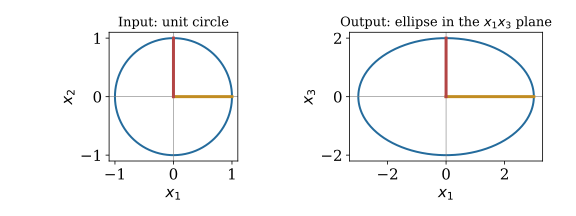
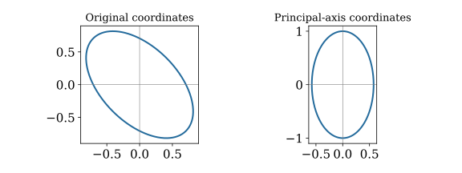

# Course Map {.deck-course-map}

::: {.columns}
::: {.column width="38%"}
<h3>Course decks</h3>

::: {style="font-size: 0.86em;"}
- [Why Linear Algebra?]()
- [Systems and Matrices]()
- [Inverses]()
- [Matrix Transformations]()
- [Determinants]()
- [Euclidean Spaces]()
- [Vector Spaces and Span]()
- [Bases and Coordinates]()
- [Matrix Spaces and Rank]()
- [Eigenvalues]()
- [Inner Products]()
- [Special Topics](){.current-deck aria-current="page"}
:::
:::

::: {.column width="4%"}
:::

::: {.column width="58%"}
<h3>In this deck</h3>

::: {.key-point}
Choose coordinates that expose structure

$\mat{A}=\mat{U}_r\mat{\Sigma}_r\mat{V}_r^{\mathsf T}$
:::

- [Singular Value Decomposition](#singular-value-decomposition)
- [Regression Through QR and SVD](#regression-through-qr-and-svd)
- [Quadratic Forms and Principal Axes](#quadratic-forms-and-principal-axes)
- [Fourier Coordinates and the FFT](#fourier-coordinates-and-the-fft)
- [Tensor Products and Structured Data](#tensor-products-and-structured-data)
- [Networks and Iterative Eigenvectors](#networks-and-iterative-eigenvectors)
- [Big Ideas](#big-ideas)

:::
:::

::: {.notes}
Instructor draft: modular sections, not a commitment to cover every topic. SVD and regression are the priority. QR/least squares and complex inner products are drafted in Inner Product Spaces (Anton §§6.3–6.6); review and teach that foundation first. Quadratic forms can precede SVD if the spectral theorem needs development first. FFT and tensors supplement Anton; networks and iterative eigenvectors are optional. Suggested demonstrations remain to be built, not linked as existing notebooks.
:::

## Which topics would you like to explore? {#class-topic-preferences}

SVD and its regression connection are our priority

Rank your next two choices and give a question or application you want to explore

- Quadratic forms and principal axes
- Fourier transforms and FFT
- Tensors and structured images
- Power iteration and PageRank
- Graph Laplacians and networks

Selections depend on class interest and remaining time

::: {.notes}
Ask for an informal show of hands or a short ranked response in class. No external poll has been created. Treat preferences as guidance for optional coverage, not a promise to cover everything.
:::

# Singular Value Decomposition {#singular-value-decomposition}

- [What can a rectangular matrix do?](#what-can-a-rectangular-matrix-do)
- [The SVD separates directions from scale](#the-svd-separates-directions-from-scale)
- [Each singular direction has its own stretch](#each-singular-direction-has-its-own-stretch)
- [A worked SVD without square roots of large matrices](#a-worked-svd-without-square-roots-of-large-matrices)
- [See the singular stretches](#svd-geometry)
- [Why an SVD exists](#why-an-svd-exists)
- [The four spaces reappear in orthonormal coordinates](#the-four-spaces-reappear-in-orthonormal-coordinates)
- [A matrix is a sum of rank-one maps](#a-matrix-is-a-sum-of-rank-one-maps)
- [The best low-rank approximation has a measurable error](#the-best-low-rank-approximation-has-a-measurable-error)
- [Practice reading singular values](#practice-reading-singular-values)

## What can a rectangular matrix do? {#what-can-a-rectangular-matrix-do}

$\mat{A}:\reals^n\to\reals^m$ may stretch, turn, and collapse directions

Eigenvectors require a square matrix; singular vectors work for every shape

::: {.key-point}
Choose orthonormal input and output directions adapted to the map
:::

## The SVD separates directions from scale {#the-svd-separates-directions-from-scale}

For a real $m\times n$ matrix of rank $r>0$:
\begin{gather*}
\mat{A}=\mat{U}_r\mat{\Sigma}_r\mat{V}_r^{\mathsf T},\qquad
\mat{\Sigma}_r=\operatorname{diag}(\sigma_1,\ldots,\sigma_r)\\
\sigma_1\ge\cdots\ge\sigma_r>0,\qquad
\mat{U}_r^{\mathsf T}\mat{U}_r=\mat{V}_r^{\mathsf T}\mat{V}_r=\mat{I}_r
\end{gather*}

| Factor | Shape | Role |
|---|---|---|
| $\mat{V}_r^{\mathsf T}$ | $r\times n$ | input coordinates |
| $\mat{\Sigma}_r$ | $r\times r$ | stretch each coordinate |
| $\mat{U}_r$ | $m\times r$ | assemble the output |

::: {.notes}
This is the compact SVD. The zero matrix has no positive singular values and an empty compact factorization; its pseudoinverse is zero. Orthogonal completions give the full SVD with U m-by-m, V n-by-n, and rectangular Sigma.
:::

## Each singular direction has its own stretch {#each-singular-direction-has-its-own-stretch}

Write $\vct{U}_j$ and $\vct{V}_j$ for columns of the compact factors
\begin{gather*}
\mat{A}\vct{V}_j=\sigma_j\vct{U}_j,\qquad
\mat{A}^{\mathsf T}\vct{U}_j=\sigma_j\vct{V}_j\\
\mat{A}\vct{x}=\sum_{j=1}^r\sigma_j\vct{U}_j
\bigl(\vct{V}_j^{\mathsf T}\vct{x}\bigr)
\end{gather*}

Input perpendicular to every $\vct{V}_j$ is sent to zero

::: {.key-point}
Singular values measure stretches, not signed eigenvalues
:::

## A worked SVD without square roots of large matrices {#a-worked-svd-without-square-roots-of-large-matrices}

\begin{gather*}
\mat{A}=\begin{pmatrix}3&0\\0&0\\0&2\end{pmatrix},\quad
\mat{U}_r=\begin{pmatrix}1&0\\0&0\\0&1\end{pmatrix},\quad
\mat{\Sigma}_r=\begin{pmatrix}3&0\\0&2\end{pmatrix},\quad
\mat{V}_r=\mat{I}_2\\
\mat{A}\begin{pmatrix}\cos t\\\sin t\end{pmatrix}
=\begin{pmatrix}3\cos t\\0\\2\sin t\end{pmatrix}
\end{gather*}

The unit circle becomes an ellipse in the $x_1x_3$ plane

::: {.key-point}
The ellipse axes are the left singular vectors; their lengths are the singular values
:::

## See the singular stretches {#svd-geometry}

::: {style="text-align: center;"}
{fig-alt="The unit input circle maps to an ellipse with semiaxes three and two in the output x1 x3 plane" width="90%" .nostretch}
:::

## Why an SVD exists {#why-an-svd-exists}

$\mat{A}^{\mathsf T}\mat{A}$ is symmetric and positive semidefinite
\begin{gather*}
\vct{x}^{\mathsf T}\mat{A}^{\mathsf T}\mat{A}\vct{x}
=\|\mat{A}\vct{x}\|^2\ge0\\
\mat{A}^{\mathsf T}\mat{A}\vct{V}_j=\sigma_j^2\vct{V}_j,\qquad
\vct{U}_j=\frac{\mat{A}\vct{V}_j}{\sigma_j}\quad(\sigma_j>0)
\end{gather*}

Orthogonal eigenvectors on the input side produce orthonormal output vectors

::: {.notes}
For positive singular values, U_i^T U_j = V_i^T A^T A V_j/(sigma_i sigma_j) = delta_ij. Use the real symmetric spectral theorem, developed in the quadratic-forms section. This is an existence argument, not a recommended numerical algorithm: forming A^T A squares the full-column-rank condition number.
:::

## The four spaces reappear in orthonormal coordinates {#the-four-spaces-reappear-in-orthonormal-coordinates}

| Space | SVD description |
|---|---|
| $\operatorname{col}(\mat{A})$ | span of $\vct{U}_1,\ldots,\vct{U}_r$ |
| $\operatorname{row}(\mat{A})$ | span of $\vct{V}_1,\ldots,\vct{V}_r$ |
| $\operatorname{null}(\mat{A})$ | perpendicular to all $\vct{V}_j$ |
| $\operatorname{null}(\mat{A}^{\mathsf T})$ | perpendicular to all $\vct{U}_j$ |

Complete the columns of $\mat{U}_r$ and $\mat{V}_r$ to orthonormal bases to obtain bases of the two null spaces

[Recall matrix spaces](#orthogonal-pairs)

## A matrix is a sum of rank-one maps {#a-matrix-is-a-sum-of-rank-one-maps}

\begin{equation*}
\mat{A}=\sum_{j=1}^r\sigma_j\vct{U}_j\vct{V}_j^{\mathsf T}
\end{equation*}

Each term reads one input coordinate and sends it along one output direction

Keep only the first $k$ terms:
\begin{equation*}
\mat{A}_k=\sum_{j=1}^k\sigma_j\vct{U}_j\vct{V}_j^{\mathsf T},\qquad 0\le k<r
\end{equation*}

A controlled approximation using fewer directions

## The best low-rank approximation has a measurable error {#the-best-low-rank-approximation-has-a-measurable-error}

Define $\|\mat{B}\|_F^2=\sum_{i,j}|b_{ij}|^2$ and
$\|\mat{B}\|_2=\max_{\|\vct{x}\|=1}\|\mat{B}\vct{x}\|$
\begin{gather*}
\|\mat{A}-\mat{A}_k\|_2=\sigma_{k+1}\\
\|\mat{A}-\mat{A}_k\|_F^2=\sum_{j=k+1}^r\sigma_j^2
\end{gather*}

$\mat{A}_k$ minimizes either error over matrices of rank at most $k$

::: {.key-point}
Choose the rank by the accuracy needed, not only by the appearance of the image
:::

::: {.notes}
Eckart–Young–Mirsky theorem; statement without proof. Approximation need not be unique when singular values tie. For an m-by-n grayscale image, storing compact factors uses k(m+n+1) scalar entries instead of mn, before file-format overhead or quantization.
:::

## Practice reading singular values {#practice-reading-singular-values}

::: {.exitem}
$\exstar$
A matrix has singular values $8,3,1$ Find the rank-one spectral error and rank-two Frobenius error How many rank-one terms reproduce the matrix exactly?
:::

::: {.notes}
Answers: 3; 1; three terms. Distinguish the two error norms.
:::

# Regression Through QR and SVD {#regression-through-qr-and-svd}

- [Regression asks for the closest attainable data](#regression-asks-for-the-closest-attainable-data)
- [QR solves full-column-rank least squares](#qr-solves-full-column-rank-least-squares)
- [The pseudoinverse reverses the nonzero stretches](#the-pseudoinverse-reverses-the-nonzero-stretches)
- [Rank deficiency changes coefficients, not the fitted vector](#rank-deficiency-changes-coefficients-not-the-fitted-vector)
- [A regression example with a redundant feature](#a-regression-example-with-a-redundant-feature)
- [Small singular values amplify data perturbations](#small-singular-values-amplify-data-perturbations)
- [Truncation and ridge control small stretches](#truncation-and-ridge-control-small-stretches)
- [Which factorization serves the regression question?](#which-factorization-serves-the-regression-question)
- [Practice separating fit from coefficients](#practice-separating-fit-from-coefficients)

## Regression asks for the closest attainable data {#regression-asks-for-the-closest-attainable-data}

Fit observations $b_i$ using features $a_{ij}$ and coefficients $x_j$
\begin{gather*}
\widehat{\vct{b}}=\mat{A}\widehat{\vct{x}},\qquad
\widehat{\vct{x}}\in\arg\min_{\vct{x}}\|\mat{A}\vct{x}-\vct{b}\|^2\\
\mat{A}^{\mathsf T}(\vct{b}-\widehat{\vct{b}})=\vct{0}
\end{gather*}

$\widehat{\vct{b}}$ is the orthogonal projection onto $\operatorname{col}(\mat{A})$

A column of ones supplies an intercept

[Prerequisite: inner products and least squares]()

## QR solves full-column-rank least squares {#qr-solves-full-column-rank-least-squares}

For $m\ge n$ and independent columns:
\begin{gather*}
\mat{A}=\mat{Q}\mat{R},\quad
\mat{Q}^{\mathsf T}\mat{Q}=\mat{I}_n,\quad
\mat{R}\text{ upper triangular and invertible}\\
\|\mat{A}\vct{x}-\vct{b}\|^2
=\|\mat{R}\vct{x}-\mat{Q}^{\mathsf T}\vct{b}\|^2
+\|(\mat{I}_m-\mat{Q}\mat{Q}^{\mathsf T})\vct{b}\|^2\\
\mat{R}\widehat{\vct{x}}=\mat{Q}^{\mathsf T}\vct{b}
\end{gather*}

Compute orthogonal coordinates, then use back substitution

::: {.notes}
Reduced QR: Q is m-by-n, R is n-by-n. This R is the triangular QR factor, different from R in A=C R; reused matrix letters are defined by the current factorization. Gram–Schmidt explains the factorization; Householder QR is the standard practical method. Full development belongs in Anton §6.3 in Inner Product Spaces; this is a refresher.
:::

## The pseudoinverse reverses the nonzero stretches {#the-pseudoinverse-reverses-the-nonzero-stretches}

\begin{gather*}
\mat{A}^{\dagger}=\mat{V}_r\mat{\Sigma}_r^{-1}\mat{U}_r^{\mathsf T}\\
\widehat{\vct{x}}=\mat{A}^{\dagger}\vct{b}
=\sum_{j=1}^r\frac{\vct{U}_j^{\mathsf T}\vct{b}}{\sigma_j}\vct{V}_j\\
\widehat{\vct{b}}=\mat{A}\widehat{\vct{x}}
=\mat{U}_r\mat{U}_r^{\mathsf T}\vct{b}
\end{gather*}

Works for rectangular and rank-deficient matrices

::: {.key-point}
The pseudoinverse selects the least-squares solution with smallest Euclidean norm
:::

## Rank deficiency changes coefficients, not the fitted vector {#rank-deficiency-changes-coefficients-not-the-fitted-vector}

Every least-squares minimizer has the form
\begin{equation*}
\vct{x}=\mat{A}^{\dagger}\vct{b}+\vct{z},\qquad
\vct{z}\in\operatorname{null}(\mat{A})
\end{equation*}

- All give the same fitted vector $\widehat{\vct{b}}$
- The pseudoinverse solution lies in $\operatorname{row}(\mat{A})$
- Adding a perpendicular null-space component increases the coefficient norm

::: {.notes}
Use the orthogonal splitting R^n = row(A) plus null(A). The minimizer is unique exactly when A has full column rank. This also covers underdetermined consistent systems.
:::

## A regression example with a redundant feature {#a-regression-example-with-a-redundant-feature}

\begin{gather*}
\mat{A}=\begin{pmatrix}1&1\\1&1\end{pmatrix},\quad
\vct{b}=\begin{pmatrix}2\\4\end{pmatrix},\quad
\vct{U}_1=\vct{V}_1=\frac1{\sqrt2}\begin{pmatrix}1\\1\end{pmatrix},\quad\sigma_1=2\\
\widehat{\vct{x}}=\begin{pmatrix}3/2\\3/2\end{pmatrix},\quad
\widehat{\vct{b}}=\begin{pmatrix}3\\3\end{pmatrix},\quad
\vct{b}-\widehat{\vct{b}}=\begin{pmatrix}-1\\1\end{pmatrix}
\end{gather*}

Both features are identical: only $x_1+x_2=3$ is identifiable

The smallest-norm solution divides the total equally

## Small singular values amplify data perturbations {#small-singular-values-amplify-data-perturbations}

A perturbation $\delta\vct{b}$ changes the pseudoinverse coefficients by
\begin{equation*}
\delta\widehat{\vct{x}}
=\sum_{j=1}^r\frac{\vct{U}_j^{\mathsf T}\delta\vct{b}}{\sigma_j}\vct{V}_j
\end{equation*}

Small positive $\sigma_j$: large coefficient changes in direction $\vct{V}_j$

For full column rank, $\kappa_2(\mat{A})=\sigma_1/\sigma_n$

::: {.key-point}
An accurate fit can coexist with poorly determined coefficients
:::

::: {.notes}
Keep rank and conditioning distinct. Exact zero singular values create nonidentifiability; small positive ones create sensitivity. Feature scaling affects these values and the meaning of a coefficient-norm penalty.
:::

## Truncation and ridge control small stretches {#truncation-and-ridge-control-small-stretches}

Truncated SVD retains only singular values above a chosen threshold $\tau$:
\begin{equation*}
\widehat{\vct{x}}_\tau
=\sum_{\sigma_j>\tau}\frac{\vct{U}_j^{\mathsf T}\vct{b}}{\sigma_j}\vct{V}_j
\end{equation*}

Ridge minimizes $\|\mat{A}\vct{x}-\vct{b}\|^2+\lambda\|\vct{x}\|^2$, $\lambda>0$:
\begin{equation*}
\widehat{\vct{x}}_\lambda
=\sum_{j=1}^r\frac{\sigma_j}{\sigma_j^2+\lambda}
(\vct{U}_j^{\mathsf T}\vct{b})\vct{V}_j
\end{equation*}

Truncation discards directions; ridge shrinks their contributions

::: {.notes}
This ridge formula penalizes every coefficient, including an intercept if present. In typical regression, center features and response or explicitly exempt the intercept; then the formula must be applied to the corresponding centered or weighted-penalty problem. Parameter choice requires a noise model or validation data; this deck introduces the algebra only.
:::

## Which factorization serves the regression question? {#which-factorization-serves-the-regression-question}

| Question | Useful tool |
|---|---|
| Full-column-rank least-squares coefficients | QR and a triangular solve |
| Rank deficiency and minimum-norm coefficients | SVD and pseudoinverse |
| Sensitivity and numerical rank | Singular values and feature scaling |
| Noise-sensitive directions | Truncation or ridge |

Forming $\mat{A}^{\mathsf T}\mat{A}$ squares $\kappa_2(\mat{A})$ when $\mat{A}$ has full column rank

Prefer an orthogonal factorization to explicitly inverting the normal-equation matrix

## Practice separating fit from coefficients {#practice-separating-fit-from-coefficients}

::: {.exitem}
$\exstar$
For the redundant-feature example, describe every least-squares solution Verify that the residual is perpendicular to both columns Explain why $(3/2,3/2)^{\mathsf T}$ has the smallest norm
:::

::: {.notes}
Solutions: $(3/2+t,3/2-t)^{\mathsf T}$, t real. Each column dotted with (-1,1)^T is zero. Squared coefficient norm is 9/2+2t^2, minimized at t=0.
:::

# Quadratic Forms and Principal Axes {#quadratic-forms-and-principal-axes}

- [Symmetry gives orthogonal eigenvectors](#symmetry-gives-orthogonal-eigenvectors)
- [A tilted ellipse becomes an axis-aligned ellipse](#a-tilted-ellipse-becomes-an-axis-aligned-ellipse)
- [See the principal axes](#principal-axis-geometry)
- [Signs distinguish bowls from saddles](#signs-distinguish-bowls-from-saddles)
- [Practice finding the principal directions](#practice-finding-the-principal-directions)

## Symmetry gives orthogonal eigenvectors {#symmetry-gives-orthogonal-eigenvectors}

For a real symmetric matrix:
\begin{gather*}
\mat{A}=\mat{Q}\mat{\Lambda}\mat{Q}^{\mathsf T},\qquad
\mat{Q}^{\mathsf T}\mat{Q}=\mat{I}\\
\vct{x}=\mat{Q}\vct{y}\implies
\vct{x}^{\mathsf T}\mat{A}\vct{x}=\sum_j\lambda_j y_j^2
\end{gather*}

The real symmetric spectral theorem: an orthonormal eigenbasis always exists

Principal-axis coordinates remove mixed terms

::: {.notes}
Distinct eigenvalues yield perpendicular eigenvectors; repeated eigenspaces admit orthonormal bases. State the spectral theorem without a full proof at this introductory level.
:::

## A tilted ellipse becomes an axis-aligned ellipse {#a-tilted-ellipse-becomes-an-axis-aligned-ellipse}

\begin{gather*}
\mat{A}=\begin{pmatrix}2&1\\1&2\end{pmatrix},\quad
\mat{Q}=\frac1{\sqrt2}\begin{pmatrix}1&1\\1&-1\end{pmatrix},\quad
\mat{\Lambda}=\begin{pmatrix}3&0\\0&1\end{pmatrix}\\
2x_1^2+2x_1x_2+2x_2^2=1
\quad\longleftrightarrow\quad 3y_1^2+y_2^2=1
\end{gather*}

Semiaxis lengths: $1/\sqrt3$ and $1$

::: {.key-point}
Eigenvectors give the axes; eigenvalues determine the curvature
:::

## See the principal axes {#principal-axis-geometry}

::: {style="text-align: center;"}
{fig-alt="A tilted ellipse in original coordinates becomes axis aligned in orthonormal eigenvector coordinates" width="90%" .nostretch}
:::

## Signs distinguish bowls from saddles {#signs-distinguish-bowls-from-saddles}

For symmetric $\mat{A}$:

| Eigenvalues | Quadratic form $\vct{x}^{\mathsf T}\mat{A}\vct{x}$ |
|---|---|
| All positive | positive definite: positive for every $\vct{x}\ne\vct{0}$ |
| All nonnegative | positive semidefinite: never negative |
| Positive and negative | indefinite: changes sign |

Least-squares curvature: $\mat{A}^{\mathsf T}\mat{A}$

Ridge curvature: $\mat{A}^{\mathsf T}\mat{A}+\lambda\mat{I}$, positive definite for $\lambda>0$

## Practice finding the principal directions {#practice-finding-the-principal-directions}

::: {.exitem}
$\exstar$
Find orthonormal eigenvectors of $\begin{pmatrix}2&-1\\-1&2\end{pmatrix}$ Use them to rewrite $2x_1^2-2x_1x_2+2x_2^2$ Is this form positive definite?
:::

::: {.notes}
The vector (1,1)^T/sqrt(2) has eigenvalue 1; (1,-1)^T/sqrt(2) has eigenvalue 3. In that ordered eigenbasis the form is y_1^2+3y_2^2, hence positive definite.
:::

# Fourier Coordinates and the FFT {#fourier-coordinates-and-the-fft}

- [Sampled signals are vectors](#sampled-signals-are-vectors)
- [Fourier directions are orthogonal over the complex field](#fourier-directions-are-orthogonal-over-the-complex-field)
- [Four samples give a concrete Fourier calculation](#four-samples-give-a-concrete-fourier-calculation)
- [The FFT reuses the even and odd calculations](#the-fft-reuses-the-even-and-odd-calculations)
- [Convolution becomes componentwise multiplication](#convolution-becomes-componentwise-multiplication)
- [Practice recognizing frequency directions](#practice-recognizing-frequency-directions)

## Sampled signals are vectors {#sampled-signals-are-vectors}

A signal sampled at $n$ equally spaced points becomes $\vct{x}\in\mathbb{C}^n$

Index samples and frequencies by $0,\ldots,n-1$
\begin{gather*}
\omega_n=e^{-2\pi\sqrt{-1}/n},\qquad
(\mat{F}_n)_{kj}=\omega_n^{kj}\\
\vct{X}=\mat{F}_n\vct{x},\qquad
\vct{x}=\frac1n\mat{F}_n^*\vct{X}
\end{gather*}

$\mat{B}^*=\overline{\mat{B}}^{\mathsf T}$ denotes the conjugate transpose

Frequency coordinates reveal oscillations hidden in the sample values

## Fourier directions are orthogonal over the complex field {#fourier-directions-are-orthogonal-over-the-complex-field}

Use $\langle\vct{u},\vct{v}\rangle=\vct{u}^*\vct{v}$
\begin{equation*}
\sum_{j=0}^{n-1}\omega_n^{(k-\ell)j}
=\begin{cases}n,&k=\ell\\0,&k\ne\ell\end{cases}
\end{equation*}

Thus $\mat{F}_n^*\mat{F}_n=n\mat{I}_n$ and $\mat{F}_n/\sqrt n$ is unitary

The DFT is a scaled change to an orthonormal basis

::: {.notes}
Frequency indices are in 0,...,n-1. For unequal indices, use the finite geometric series; omega_n^(k-l) is not 1. The inverse basis vectors use positive exponents, consistent with the earlier continuous Fourier convention. Distinguish a complex inner product from an ordinary transpose product.
:::

## Four samples give a concrete Fourier calculation {#four-samples-give-a-concrete-fourier-calculation}

\begin{gather*}
\mat{F}_4=\begin{pmatrix}
1&1&1&1\\1&-\sqrt{-1}&-1&\sqrt{-1}\\
1&-1&1&-1\\1&\sqrt{-1}&-1&-\sqrt{-1}
\end{pmatrix}\\
\vct{x}=\begin{pmatrix}1\\0\\-1\\0\end{pmatrix}
\implies\vct{X}=\begin{pmatrix}0\\2\\0\\2\end{pmatrix}
\end{gather*}

A real cosine uses a pair of opposite frequency directions

::: {.notes}
For real data X_(n-k) is the conjugate of X_k, with indices modulo n. The frequencies 1 and 3 for n=4 correspond to +1 and -1 cycles per record, not two unrelated physical oscillations.
:::

## The FFT reuses the even and odd calculations {#the-fft-reuses-the-even-and-odd-calculations}

For even $n$, split $x_0,x_2,\ldots$ from $x_1,x_3,\ldots$

Let $E_k$ and $O_k$ be their length-$n/2$ DFTs
\begin{align*}
X_k&=E_k+\omega_n^k O_k\\
X_{k+n/2}&=E_k-\omega_n^k O_k,\qquad 0\le k<n/2
\end{align*}

For $n=2^p$, repeat the split down to one-sample transforms
\begin{equation*}
T(n)=2T(n/2)+O(n)=O(n\log n)
\end{equation*}

::: {.key-point}
The FFT computes the same DFT through a sparse recursive factorization
:::

## Convolution becomes componentwise multiplication {#convolution-becomes-componentwise-multiplication}

Circular convolution of length-$n$ vectors:
\begin{gather*}
y_j=\sum_{\ell=0}^{n-1}h_\ell x_{(j-\ell)\bmod n}\\
\mat{F}_n\vct{y}=(\mat{F}_n\vct{h})\odot(\mat{F}_n\vct{x})
\end{gather*}

$\odot$: multiply matching coordinates

A circulant filter is diagonal in Fourier coordinates

Zero-pad to at least $n_x+n_h-1$ samples to compute ordinary finite linear convolution

::: {.notes}
Interpret boundary assumptions: circular convolution wraps the signal. Arbitrary frequency truncation may cause ringing; the purpose here is to show the linear algebra, not promise universal denoising.
:::

## Practice recognizing frequency directions {#practice-recognizing-frequency-directions}

::: {.exitem}
$\exstar$
Compute the DFT of $(1,1,1,1)^{\mathsf T}$ and $(1,-1,1,-1)^{\mathsf T}$ Which is constant and which alternates? Why does the FFT leave these answers unchanged?
:::

::: {.notes}
Answers: (4,0,0,0)^T and (0,0,4,0)^T. Frequencies 0 and 2. FFT changes the computation, not the linear transformation.
:::

# Tensor Products and Structured Data {#tensor-products-and-structured-data}

- [An outer product separates two directions](#an-outer-product-separates-two-directions)
- [A tensor has coordinates after choosing bases](#a-tensor-has-coordinates-after-choosing-bases)
- [Kronecker products apply maps to both factors](#kronecker-products-apply-maps-to-both-factors)
- [Transform an image along rows and columns](#transform-an-image-along-rows-and-columns)
- [More indices describe more modes](#more-indices-describe-more-modes)
- [Practice spotting separability](#practice-spotting-separability)

## An outer product separates two directions {#an-outer-product-separates-two-directions}

\begin{gather*}
\vct{u}=\begin{pmatrix}1\\2\end{pmatrix},\quad
\vct{v}=\begin{pmatrix}3\\4\\5\end{pmatrix},\qquad
\vct{u}\vct{v}^{\mathsf T}=\begin{pmatrix}3&4&5\\6&8&10\end{pmatrix}\\
a_{ij}=u_i v_j
\end{gather*}

One pattern down the rows, one across the columns

A nonzero outer product has rank one

SVD builds matrices by summing such separated patterns

## A tensor has coordinates after choosing bases {#a-tensor-has-coordinates-after-choosing-bases}

For finite-dimensional real spaces $V$ and $W$ with bases $\{\vct{e}_i\}$ and $\{\vct{f}_j\}$:
\begin{gather*}
V\otimes W\text{ has basis }\{\vct{e}_i\otimes\vct{f}_j\}_{i,j}\\
T=\sum_{i,j}t_{ij}\vct{e}_i\otimes\vct{f}_j,\qquad
\dim(V\otimes W)=\dim(V)\dim(W)
\end{gather*}

$\otimes$ is bilinear; a general tensor is a sum of elementary tensors

The elementary tensor $\vct{u}\otimes\vct{v}$ has coordinate matrix $\vct{u}\vct{v}^{\mathsf T}$

::: {.key-point}
The coordinate array uses the listed orders of the chosen bases
:::

::: {.notes}
This is an introductory finite-dimensional description. Tensor products can be characterized by a universal property for bilinear maps; defer that abstraction. V tensor W is not canonically the space of maps W to V: that identification uses W's dual, or an explicitly chosen inner product. Avoid equating every two-index tensor with a linear operator without this distinction.
:::

## Kronecker products apply maps to both factors {#kronecker-products-apply-maps-to-both-factors}

For matrices $\mat{B}$ and $\mat{C}$:
\begin{gather*}
\mat{B}\otimes\mat{C}=[b_{ij}\mat{C}]_{i,j}\\
(\mat{B}\otimes\mat{C})(\vct{u}\otimes\vct{v})
=(\mat{B}\vct{u})\otimes(\mat{C}\vct{v})
\end{gather*}

If $\mat{B}$ is $p\times m$ and $\mat{C}$ is $q\times n$, their Kronecker product is $pq\times mn$

Here the coordinate vector for $\vct{u}\otimes\vct{v}$ lists one block $u_i\vct{v}$ per $i$

::: {.notes}
The ordering of tensor-product coordinates matters. This block convention agrees with NumPy kron(u,v). The next slide separately specifies column stacking for vectorization; there is no implicit claim that these two listings use the same order.
:::

## Transform an image along rows and columns {#transform-an-image-along-rows-and-columns}

For an $m\times n$ image matrix $\mat{X}$:
\begin{gather*}
\mat{Y}=\mat{B}\mat{X}\mat{C}^{\mathsf T}\\
\operatorname{vec}(\mat{Y})=(\mat{C}\otimes\mat{B})\operatorname{vec}(\mat{X})
\end{gather*}

$\operatorname{vec}$ stacks columns; $\mat{B}$ acts on row indices and $\mat{C}$ on column indices

Two-dimensional DFT: $\mat{Y}=\mat{F}_m\mat{X}\mat{F}_n^{\mathsf T}$

::: {.key-point}
Apply the smaller transforms separately instead of building a giant Kronecker matrix
:::

## More indices describe more modes {#more-indices-describe-more-modes}

An image with color channels has coordinates $t_{ijk}$

An elementary three-factor tensor has $t_{ijk}=u_i v_j w_k$
\begin{equation*}
\mathcal{T}=\sum_{\ell=1}^s\vct{u}_\ell\otimes\vct{v}_\ell\otimes\vct{w}_\ell
\end{equation*}

A contraction sums matching indices, for example
\begin{equation*}
y_i=\sum_{j,k}t_{ijk}v_j w_k
\end{equation*}

::: {.notes}
With real Euclidean coordinate spaces, v and w can represent covectors via the chosen inner products. General contractions pair a space with its dual. For tensors of order three or more, the smallest number of elementary terms is tensor rank; matrix SVD does not directly supply an analogous universal orthogonal decomposition. Avoid claiming that truncating a tensor decomposition is always a best approximation.
:::

## Practice spotting separability {#practice-spotting-separability}

::: {.exitem}
$\exstar$
Which matrix is a single outer product? $\mat{X}=\begin{pmatrix}1&2\\3&6\end{pmatrix}$, $\quad\mat{Y}=\begin{pmatrix}1&2\\3&7\end{pmatrix}$ For $\dim(V)=2$ and $\dim(W)=3$, how many product-basis vectors are needed?
:::

::: {.notes}
X=(1,3)^T(1,2); rank one. Y has determinant 1 and rank two, so it is not a single outer product. The tensor-product dimension is 6.
:::

# Networks and Iterative Eigenvectors {#networks-and-iterative-eigenvectors}

- [Power iteration finds a dominant direction](#power-iteration-finds-a-dominant-direction)
- [PageRank makes a random walk converge](#pagerank-makes-a-random-walk-converge)
- [A graph Laplacian measures disagreement](#a-graph-laplacian-measures-disagreement)
- [Practice connecting networks to null spaces](#practice-connecting-networks-to-null-spaces)

## Power iteration finds a dominant direction {#power-iteration-finds-a-dominant-direction}

Choose a nonzero $\vct{x}_0$ and repeat
\begin{equation*}
\vct{x}_{k+1}=\frac{\mat{A}\vct{x}_k}{\|\mat{A}\vct{x}_k\|}
\end{equation*}

For a real diagonalizable matrix with $|\lambda_1|>|\lambda_2|$ and a nonzero dominant component:

- Direction approaches the dominant eigenspace
- Typical asymptotic factor: $|\lambda_2/\lambda_1|$
- A negative dominant eigenvalue can alternate the sign

::: {.notes}
Require a simple unique eigenvalue of maximal modulus and a starting vector with nonzero coefficient in that eigenvector in an eigenbasis. The normalization denominator must not vanish. Equal maximal moduli or a missing dominant component can prevent the intended convergence. This is a theorem under stated assumptions, not a guarantee for every matrix.
:::

## PageRank makes a random walk converge {#pagerank-makes-a-random-walk-converge}

Let $\mat{P}$ be column stochastic, with dangling columns replaced by probability vectors
\begin{gather*}
\mat{G}=\alpha\mat{P}+(1-\alpha)\vct{v}\vct{1}^{\mathsf T},\qquad
0<\alpha<1,\quad v_i>0,\quad\vct{1}^{\mathsf T}\vct{v}=1\\
\vct{p}_{k+1}=\mat{G}\vct{p}_k,\qquad
\mat{G}\vct{p}=\vct{p},\quad\vct{1}^{\mathsf T}\vct{p}=1
\end{gather*}

Follow a link with probability $\alpha$; restart with probability $1-\alpha$

Positivity gives a unique stationary distribution and convergence from any probability vector

::: {.notes}
Present PageRank as the classical mathematical model, not a description of a current search engine's complete ranking system. With column-stochastic convention, probability vectors are columns and transition columns sum to one.
:::

## A graph Laplacian measures disagreement {#a-graph-laplacian-measures-disagreement}

For an undirected graph, choose an orientation and let $\mat{D}$ have one row per edge

An edge $i\to j$ has $-1$ in column $i$ and $+1$ in column $j$
\begin{gather*}
\mat{L}=\mat{D}^{\mathsf T}\mat{D},\qquad
\vct{x}^{\mathsf T}\mat{L}\vct{x}
=\sum_{\{i,j\}\text{ edge}}(x_i-x_j)^2
\end{gather*}

- $\mat{L}$ is symmetric positive semidefinite
- Its null vectors are constant on each connected component
- Nullity counts connected components, including isolated vertices

## Practice connecting networks to null spaces {#practice-connecting-networks-to-null-spaces}

::: {.exitem}
$\exstar$
A graph has edges $\{1,2\}$ and $\{2,3\}$ and isolated vertex $4$ Build its incidence matrix and Laplacian Find a basis for the Laplacian null space
:::

::: {.notes}
D=[[-1,1,0,0],[0,-1,1,0]]. L=[[1,-1,0,0],[-1,2,-1,0],[0,-1,1,0],[0,0,0,0]]. A null-space basis is (1,1,1,0)^T and (0,0,0,1)^T. Nullity two matches two connected components.
:::

# Big Ideas {#big-ideas data-state="goldborder"}

- [SVD]{.alert}: orthonormal directions and their stretches
- [Regression]{.alert}: projection, coefficient sensitivity, and regularization
- [Principal axes]{.alert}: diagonal coordinates reveal quadratic geometry
- [FFT]{.alert}: exploit structure to compute Fourier coordinates efficiently
- [Tensor products]{.alert}: combine spaces and apply separate maps
- [Networks]{.alert}: eigenvectors and null spaces explain global behavior

# How Far We Have Come

[SVD and regression are core; extensions can follow the class's interests]{.alert}

::: {.columns}
::: {.column width="47%"}
- [](#inconsistent-systems-still-have-a-best-fit) — regression finds best fits; QR solves them in orthogonal coordinates
- [](#rank-factorization-keeps-the-independent-columns-and-rows) — SVD gives directions and stretches; nonzero singular values count rank; truncation gives low-rank approximations
- [Minimum-norm fit](#the-pseudoinverse-reverses-the-nonzero-stretches) — $\mat{A}^{\dagger}\vct{b}$ gives the shortest least-squares coefficient vector; null vectors leave the fit unchanged
:::

::: {.column width="6%"}
:::

::: {.column width="47%"}
- [Principal axes](#symmetry-gives-orthogonal-eigenvectors) — real symmetric matrices have orthonormal eigenvectors; eigenvalue signs classify shape
- [Fourier coordinates](#the-fft-reuses-the-even-and-odd-calculations) — FFT reuses smaller DFTs to compute frequency coordinates
- [Tensor products](#a-tensor-has-coordinates-after-choosing-bases) — factor bases give array coordinates; $\mat{B}\otimes\mat{C}$ acts on both factors
- [Networks](#networks-and-iterative-eigenvectors) — repeated actions drive power iteration/PageRank; undirected Laplacian nullity counts components
:::
:::

::: {.key-point}
Choose bases and factorizations to reveal attainable outputs, lost directions, and useful structure
:::

::: {.notes}
This is a modular recap for the draft's possible coverage, not a promise to teach every extension. Keep the SVD/regression connection; retain the principal-axis, Fourier, tensor, and network bullets for modules actually selected with the class. The SVD compression statement refers to truncating to the largest singular values; the first omitted singular value gives the spectral-norm error. Power-iteration convergence requires the assumptions stated in its own slide. The graph component statement is for the undirected combinatorial Laplacian used here. Singular-vector coordinates use different input and output bases; they are not generally an eigenbasis of A.
:::

# What Comes Next

Choose an application and identify:

- The input and output spaces
- The basis or factorization that exposes its structure
- The assumptions behind the calculation
- The error, sensitivity, and cost that matter

[Revisit inner products]()

# Terms to Know {#terms-to-know}

- [Compact SVD; singular values](#the-svd-separates-directions-from-scale)
- [Low-rank approximation](#the-best-low-rank-approximation-has-a-measurable-error)
- [QR factorization](#qr-solves-full-column-rank-least-squares)
- [Pseudoinverse](#the-pseudoinverse-reverses-the-nonzero-stretches)
- [Ridge regression](#truncation-and-ridge-control-small-stretches)
- [Quadratic form; principal axes](#symmetry-gives-orthogonal-eigenvectors)

## Terms to know: Fourier, tensors, and networks

- [DFT; conjugate transpose](#sampled-signals-are-vectors)
- [FFT](#the-fft-reuses-the-even-and-odd-calculations)
- [Circular convolution](#convolution-becomes-componentwise-multiplication)
- [Tensor product](#a-tensor-has-coordinates-after-choosing-bases)
- [Kronecker product](#kronecker-products-apply-maps-to-both-factors)
- [Power iteration](#power-iteration-finds-a-dominant-direction)
- [PageRank](#pagerank-makes-a-random-walk-converge)
- [Graph Laplacian](#a-graph-laplacian-measures-disagreement)

## Reading and exploration

Selected Anton Chapters 7–10: quadratic forms, transformations, SVD, compression, iterative methods, and networks

Supplementary Fourier and tensor material:
[Strang's Lecture Notes for Linear Algebra](https://math.mit.edu/~gs/LectureNotes/), Parts 7, 9, and 10

::: {.notes}
Anton 12th Applications crosswalk: §§7.1–7.4 orthogonal matrices, orthogonal diagonalization, quadratic forms and optimization; §§8.4–8.5 matrix representations and similarity provide supporting coordinate concepts; §§9.2, 9.4–9.5 power method, SVD and compression; §§10.4–10.5 Markov chains and graph theory, §10.19 search engines. QR and regression prerequisites are §§6.3–6.5. DFT/FFT and tensor products are supplementary. Verify reading selections against the instructor's live textbook before assigning exercises. Companion notebook candidates: low-rank image approximation, nearly collinear regression with QR/SVD/ridge, FFT filtering, Kronecker/vec identity, PageRank and disconnected-graph Laplacians.
:::
